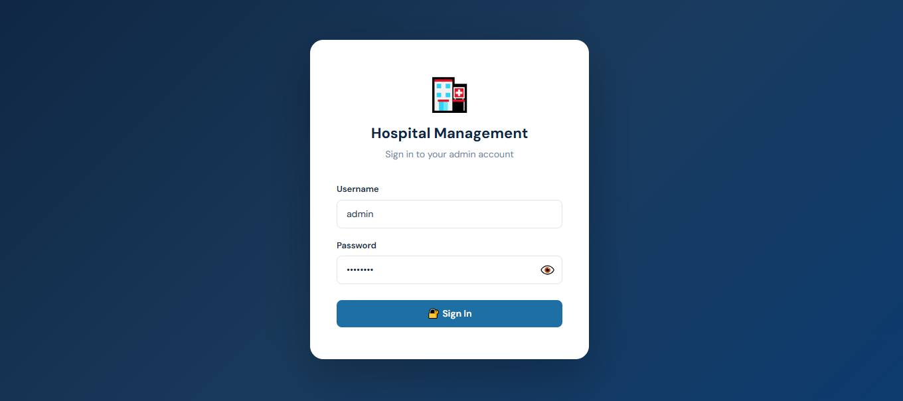
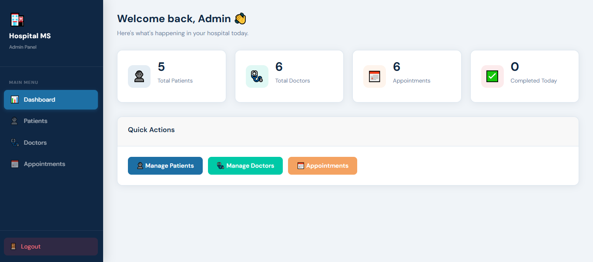
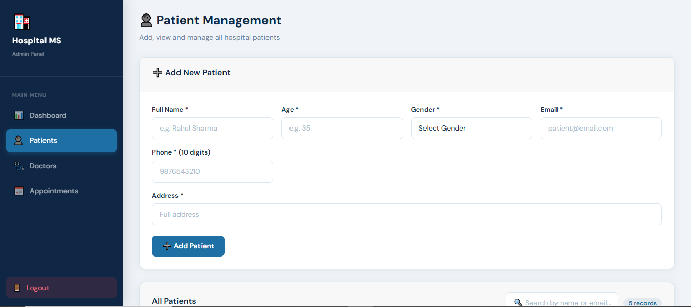
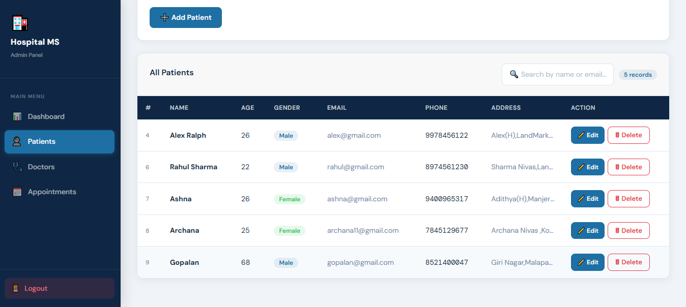
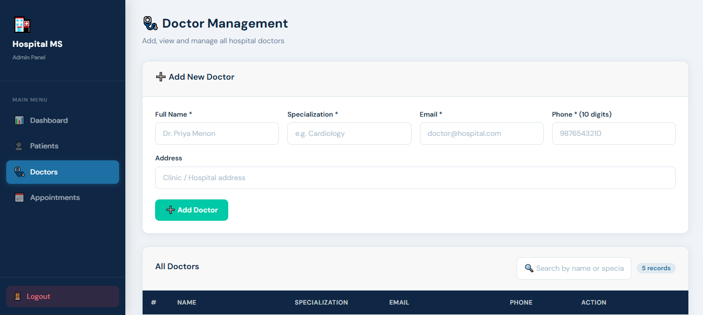
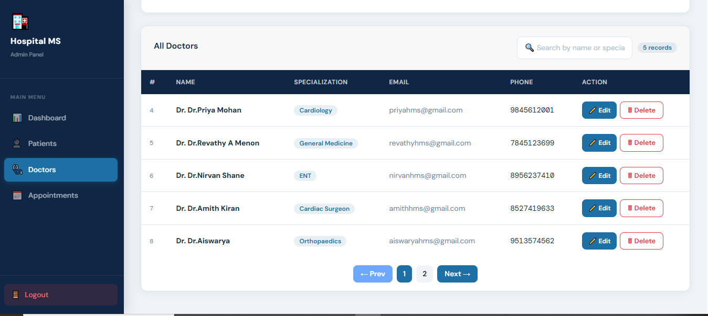
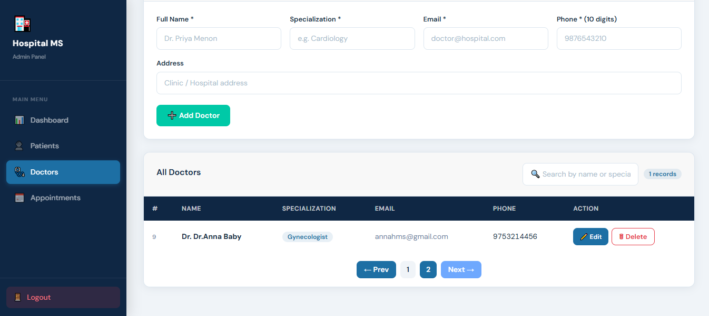
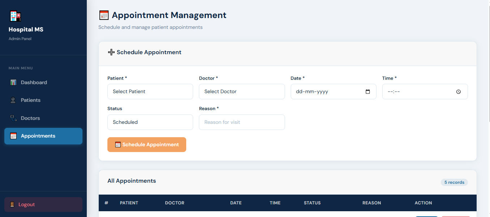
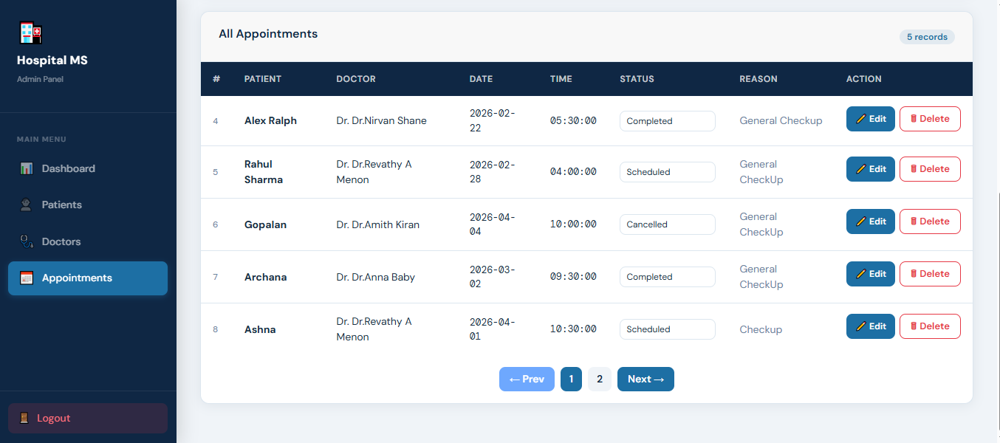

# 🏥 Hospital Management System

A full-stack **Hospital Management System** built with **Angular** (frontend) and **Spring Boot** (backend). Designed for hospital administrators to efficiently manage patients, doctors, and appointments with secure JWT-based authentication.

---

## 🔗 Live Demo
> Coming soon

---

## 📸 Screenshots










---

## ✨ Features

- 🔐 **JWT Authentication** — Secure login with token-based authorization
- 👁️ **Password Toggle** — Show/hide password on login page
- 👤 **Patient Management** — Add, edit, delete and search patients with pagination
- 🩺 **Doctor Management** — Add, edit, delete and search doctors with pagination
- 📅 **Appointment Management** — Schedule, edit, delete appointments
- ⚡ **Inline Status Update** — Change appointment status (Scheduled / Completed / Cancelled) directly from the table without opening edit form
- 📄 **Pagination & Search** — Server-side pagination and search across all modules
- 📊 **Admin Dashboard** — Overview of total patients, doctors and appointments

---

## 🛠️ Tech Stack

### Frontend
| Technology | Details |
|---|---|
| Angular 17 | Standalone components |
| TypeScript | Strongly typed logic |
| HTML & CSS | Custom responsive UI |
| Angular HttpClient | REST API consumption |
| JWT Token | Stored in localStorage |

### Backend
| Technology | Details |
|---|---|
| Spring Boot | REST API |
| Spring Security | JWT Authentication |
| Spring Data JPA | Database ORM |
| MySQL | Relational Database |
| Maven | Build tool |

---

## 📁 Project Structure

```
hospital-management-system/
├── hms-frontend/         # Angular 17 frontend
│   ├── src/
│   │   ├── app/
│   │   │   ├── auth/         # Login page
│   │   │   ├── dashboard/    # Admin dashboard
│   │   │   ├── patient/      # Patient module
│   │   │   ├── doctor/       # Doctor module
│   │   │   └── appointment/  # Appointment module
│   └── ...
│
└── hms-backend/          # Spring Boot backend
    ├── src/main/java/com/hms/HospitalMS/
    │   ├── controller/   # REST Controllers
    │   ├── model/        # Entity classes
    │   ├── repository/   # JPA Repositories
    │   ├── service/      # Business logic
    │   ├── security/     # JWT Filter & Util
    │   └── config/       # Security & Swagger config
    └── ...
```

---

## ⚙️ Getting Started

### Prerequisites
- Node.js & npm
- Angular CLI (`npm install -g @angular/cli`)
- Java 17+
- Maven
- MySQL

---

### 🗄️ Database Setup

1. Open MySQL and run:
```sql
CREATE DATABASE hmsdb;
```

2. Update `hms-backend/src/main/resources/application.properties`:
```properties
spring.datasource.url=jdbc:mysql://localhost:3306/hmsdb
spring.datasource.username=root
spring.datasource.password=your_mysql_password
```

---

### ▶️ Run the Backend

```bash
cd hms-backend
mvn spring-boot:run
```
Backend runs on: `http://localhost:8080`

---

### ▶️ Run the Frontend

```bash
cd hms-frontend
npm install
ng serve
```
Frontend runs on: `http://localhost:4200`

---

### 🔑 Default Login Credentials

| Username | Password |
|---|---|
| admin | admin123 |

---

## 📡 API Endpoints

| Method | Endpoint | Description |
|---|---|---|
| POST | `/api/auth/login` | Login and get JWT token |
| GET | `/api/patients` | Get all patients (paginated) |
| POST | `/api/patients` | Create new patient |
| PUT | `/api/patients/{id}` | Update patient |
| DELETE | `/api/patients/{id}` | Delete patient |
| GET | `/api/doctors` | Get all doctors (paginated) |
| POST | `/api/doctors` | Create new doctor |
| PUT | `/api/doctors/{id}` | Update doctor |
| DELETE | `/api/doctors/{id}` | Delete doctor |
| GET | `/api/appointments` | Get all appointments (paginated) |
| POST | `/api/appointments` | Create appointment |
| PUT | `/api/appointments/{id}` | Update appointment |
| DELETE | `/api/appointments/{id}` | Delete appointment |

---

## 👩‍💻 Author

**Ashika K**
- GitHub: [@k-ashika](https://github.com/k-ashika)

---

## 📄 License

This project is open source and available under the [MIT License](LICENSE).
